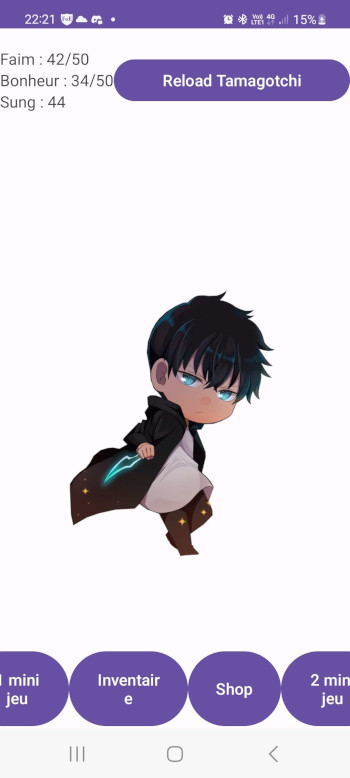
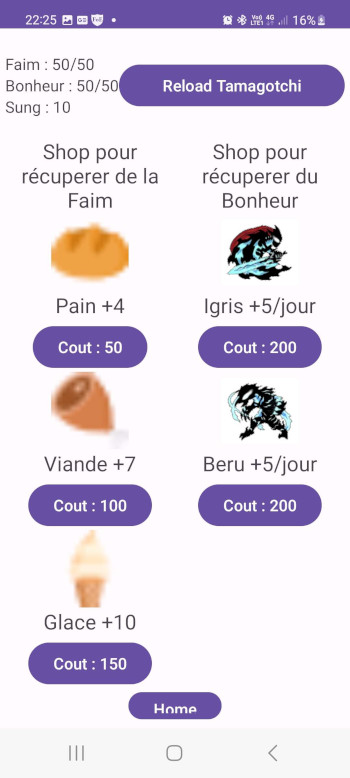
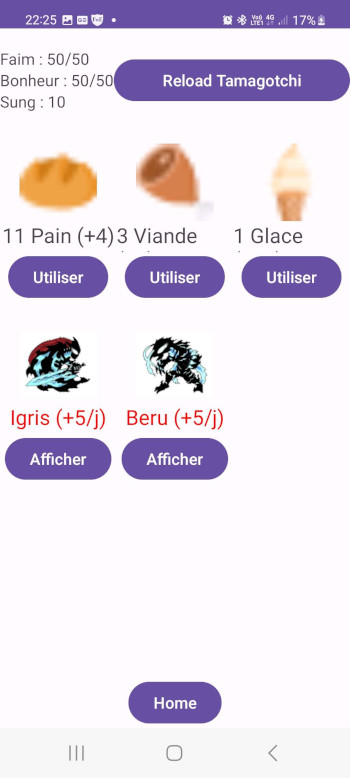
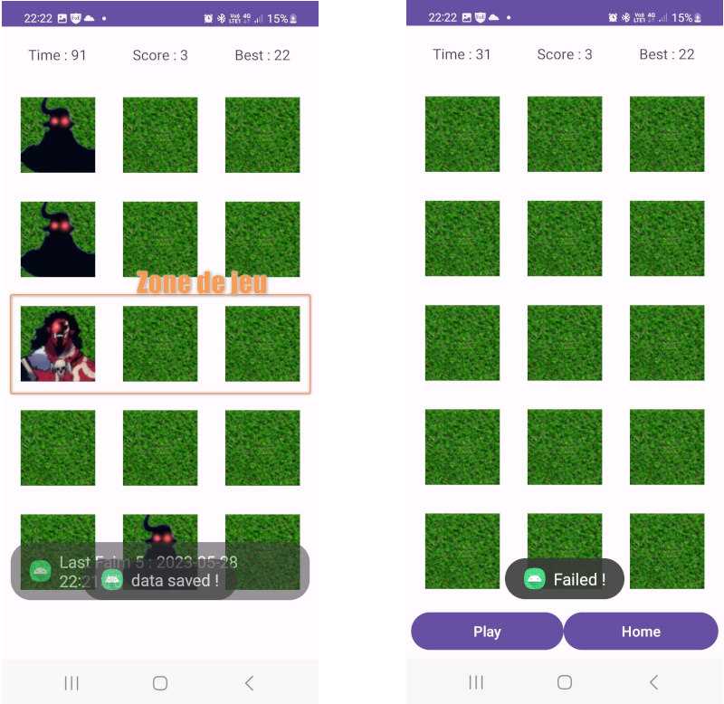
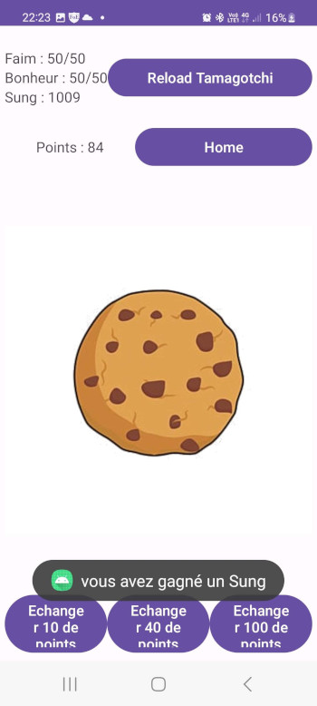

# Tamagotchi
Une appli Android de **Tamagotchi** basé sur l'univers de Solo levelling (personnage nommé "Sung")

## Features
* gestion des points de faim
* gestion des points de bonheur
* gestion des points d'argent (des Sungs
* boutique d'achat d'objets
* Inventaire des objets achetés
* Mini jeu click-cookie pour gagner des points a transformer en argent
* Mini jeu de type "PianoTiles" 

## Installation
Télécharger le dernier [APK](res/app_tamagotchi_v5.apk)
et ouvrer le sur votre appareil pour l'installer manuellement.

**Note :** cette application ne provenant pas d'un PlayStore reconnu, il est nécessaire d'accepter les avertissements d'Android concernant la potentialité de danger lors de l'installation de l'application.

## Compatibilité
Cette application Android nécessite :
- une tablette ou un smartphone Android
- avec une version 26 (Oréo) minimum

## Usage
Une fois l'application lancée, vous arrivez sur la page d'accueil.  

Vous trouvez en haut à droite :
* votre total de points de Faim (50 max)
* votre total de points de Bonheur (50 max)
* votre total de pieces d'argent "Sung" gagnées

Vous perdez un point de Faim toutes les heures.
Vous perdez 2 points de Bonheur toutes les heures.

En cliquant sur reload, vous reinitialisez votre Tamagotchi (fichier de donnees tammagotchi-data.json) avec les valeurs suivantes :
* Faim = 50 sur 50 (=le max)
* Bonheur = 50 sur 50 (=le max)
* argent = 0 (=remise à zéro)

Pour gagner des points Faim et Bonheur, vous devez jouer aux 2 mini-jeu proposés (bouton en bas a droite et en bas à gauche de l'accueil).

Dans les mini-jeux (voir les 2 chapitres "Mini-jeu ...", vous allez gagner des points que vous pourrez convertir en pieces.

Vous pouvez ensuite utilisez ces pieces dans votre **Boutique** pour acheter des points de Faim (Pain, Viande, Glace). 
Ces points sont alors accessible dans votre inventaire pour gagner des points de Faim et de Bonheur.

Si vous arrivez a 0 Faim, votre Tamagotchi meurt !

### Boutique/Shop
Permet d'acheter des items pour récupérer de la Faim grace a des pieces gagnées.

### Inventaire
Permet d'utiliser les items achetés dasn le Shop.

### Mini-jeu 1 : Pianotiles
Pendant 15 sec., vous devez taper sur un maximum de Vilains de la 3eme ligne, sans taper sur un carré de pelouse (vert).
Ainsi vous gagnez des points a convertir en piece via les boutons du bas.

### Mini-jeu 2 : Click-Cookies
Cliquez autant de fois que souhaité sur l'image du cookie. Cela incrénente vos points que vous pouvez convertir en pieces (10 points = 1 piece)

